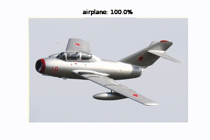

# Cifar-10 CNN
This is the first of many of my few Neural Network projects. I felt that making one with MNIST is usually what people start off with for their CNNs, when in fact it is somewhat of an overkill considering KNN can achieve an error of 0.52%. Therefore I decided to go with Cifar-10. I started the CNN with two hidden layers, and just started optimizing the parameters from there, and achieved a 90% accuracy.

After the model was trained, I was interested in other how good this model is on images from outside the data set, and so I downloaded a few images, and wrote the guessFile.ipynb to test these images with the model. One thing I'm quite proud off is the feature extraction. With the image of the wolf (badTest06), it was able to identify it on a dog, due to the two creatures similar yet distinct features instead of identifying it as a cat, horse, or some other animal.

Training this model took just under 2 hours on a 2080S.

**I do not own any of the images found in this project file. They were used for testing purposes, and if downloaded should also be used for similar purposes.**

